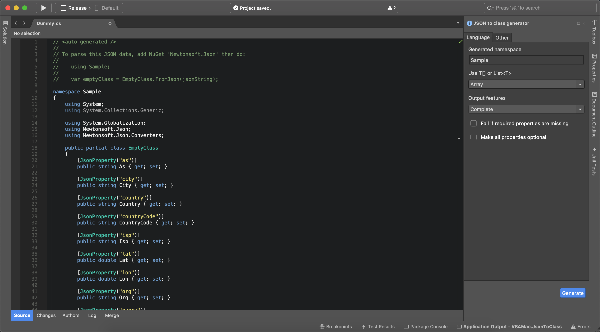

# VS4Mac JSON to class

**JsonToClass** is a Visual Studio for macOS addin to generate models (classes) from JSON. 
This addin uses [quicktype](https://github.com/quicktype/quicktype), it is necessary to have it installed!

## Copyright and license

Code released under the [MIT license](https://opensource.org/licenses/MIT).
